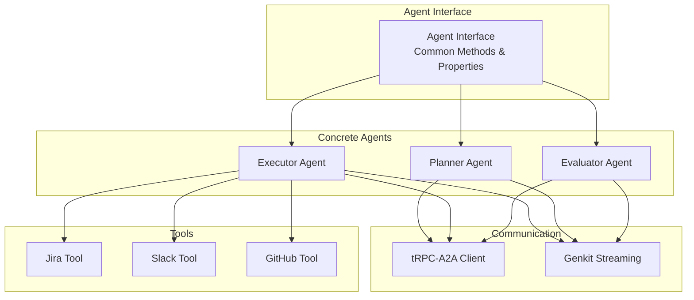
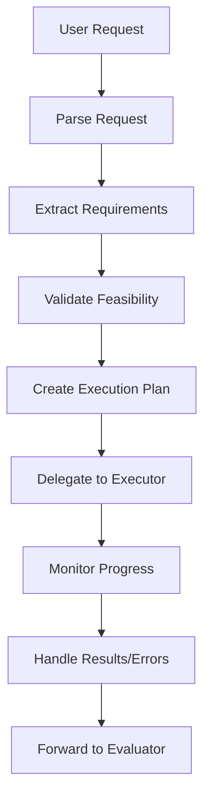
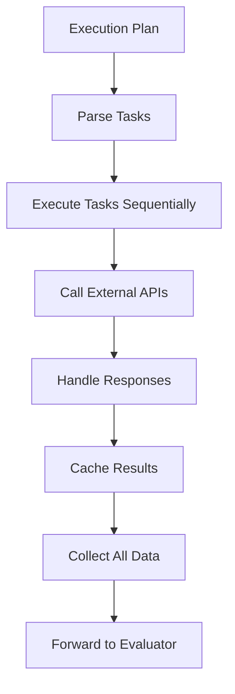
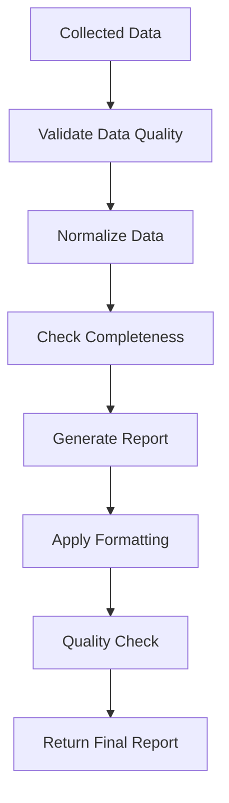

# Agent Specifications

Detailed specifications for each agent in the hierarchical multi-agent system.

## 🤖 Agent Architecture Overview



## 📋 Common Agent Interface

### Base Agent Structure
```go
type Agent interface {
    // Core agent functionality
    Initialize(config AgentConfig) error
    ProcessRequest(ctx context.Context, req *Request) (*Response, error)
    StreamProgress(ctx context.Context, req *Request) (<-chan ProgressUpdate, error)

    // Communication methods
    SendMessage(ctx context.Context, targetAgent string, message *Message) error
    ReceiveMessage(ctx context.Context, message *Message) error

    // Lifecycle management
    Start(ctx context.Context) error
    Stop(ctx context.Context) error
    Status() AgentStatus
}
```

### Common Data Structures
```go
type Request struct {
    ID          string                 `json:"id"`
    Type        RequestType            `json:"type"`
    Payload     map[string]interface{} `json:"payload"`
    Metadata    map[string]string      `json:"metadata"`
    Timestamp   time.Time              `json:"timestamp"`
    SourceAgent string                 `json:"source_agent"`
}

type Response struct {
    ID          string                 `json:"id"`
    Success     bool                   `json:"success"`
    Data        map[string]interface{} `json:"data"`
    Error       string                 `json:"error,omitempty"`
    Metadata    map[string]string      `json:"metadata"`
    Timestamp   time.Time              `json:"timestamp"`
    TargetAgent string                 `json:"target_agent"`
}

type Message struct {
    ID          string            `json:"id"`
    Type        MessageType       `json:"type"`
    Content     interface{}       `json:"content"`
    FromAgent   string            `json:"from_agent"`
    ToAgent     string            `json:"to_agent"`
    Timestamp   time.Time         `json:"timestamp"`
    Correlation string            `json:"correlation_id"`
}
```

## 🎯 Planner Agent

### Agent Profile
- **Name**: Planner Agent
- **Role**: Request analysis and workflow planning
- **Hierarchy Level**: Top-level (coordinates workflow)
- **Communication**: Initiates requests to Executor Agent

### Core Responsibilities
1. **Request Analysis**
   - Parse natural language user requests
   - Extract data source requirements
   - Identify collection parameters
   - Validate request feasibility

2. **Workflow Planning**
   - Create execution plans
   - Determine task dependencies
   - Schedule execution sequence
   - Estimate resource requirements

3. **Coordination**
   - Delegate tasks to Executor Agent
   - Monitor execution progress
   - Handle plan modifications
   - Manage error recovery

### Processing Flow


### Request Types
```go
type RequestType string

const (
    RequestTypeDataCollection RequestType = "data_collection"
    RequestTypeReportGeneration RequestType = "report_generation"
    RequestTypeStatusQuery RequestType = "status_query"
)

type PlannerRequest struct {
    BaseRequest
    Query           string   `json:"query"`
    DataSources     []string `json:"data_sources"`
    TimeRange       *TimeRange `json:"time_range,omitempty"`
    OutputFormat    string   `json:"output_format"`
    Priority        Priority `json:"priority"`
}

type ExecutionPlan struct {
    ID              string            `json:"id"`
    Tasks           []Task            `json:"tasks"`
    Dependencies    []Dependency      `json:"dependencies"`
    EstimatedDuration time.Duration   `json:"estimated_duration"`
    ResourceRequirements map[string]int `json:"resource_requirements"`
}

type Task struct {
    ID           string                 `json:"id"`
    Type         TaskType               `json:"type"`
    DataSource   string                 `json:"data_source"`
    Parameters   map[string]interface{} `json:"parameters"`
    Dependencies []string               `json:"dependencies"`
    Priority     Priority               `json:"priority"`
}
```

### Implementation Details
```go
type PlannerAgent struct {
    config     *PlannerConfig
    trpcClient *trpca2a.Client
    genkit     *genkit.Genkit
    storage    Storage
    logger     *zap.Logger
}

func (p *PlannerAgent) ProcessRequest(ctx context.Context, req *Request) (*Response, error) {
    // Parse and analyze user request
    parsedReq, err := p.parseRequest(req)
    if err != nil {
        return nil, fmt.Errorf("request parsing failed: %w", err)
    }

    // Create execution plan
    plan, err := p.createExecutionPlan(parsedReq)
    if err != nil {
        return nil, fmt.Errorf("plan creation failed: %w", err)
    }

    // Delegate to executor
    execResp, err := p.delegateToExecutor(ctx, plan)
    if err != nil {
        return nil, fmt.Errorf("delegation failed: %w", err)
    }

    return &Response{
        ID:          req.ID,
        Success:     true,
        Data:        map[string]interface{}{"plan": plan},
        TargetAgent: req.SourceAgent,
    }, nil
}
```

## ⚡ Executor Agent

### Agent Profile
- **Name**: Executor Agent
- **Role**: Task execution and API integration
- **Hierarchy Level**: Middle-level (executes tasks)
- **Communication**: Receives from Planner, reports to Evaluator

### Core Responsibilities
1. **Task Execution**
   - Execute individual tasks from execution plan
   - Manage API calls to external services
   - Handle authentication and authorization
   - Implement rate limiting and retry logic

2. **Data Collection**
   - Fetch data from Jira, Slack, GitHub APIs
   - Normalize and validate collected data
   - Implement caching strategies
   - Handle data transformation

3. **Error Management**
   - Implement robust error handling
   - Execute retry mechanisms
   - Provide detailed error reports
   - Manage fallback strategies

### Processing Flow


### Tool System
```go
type Tool interface {
    Name() string
    Execute(ctx context.Context, params map[string]interface{}) (*ToolResult, error)
    Validate(params map[string]interface{}) error
}

type ExecutorAgent struct {
    config     *ExecutorConfig
    trpcClient *trpca2a.Client
    genkit     *genkit.Genkit
    tools      map[string]Tool
    storage    Storage
    cache      Cache
    logger     *zap.Logger
}

func (e *ExecutorAgent) ProcessRequest(ctx context.Context, req *Request) (*Response, error) {
    plan, ok := req.Payload["plan"].(ExecutionPlan)
    if !ok {
        return nil, fmt.Errorf("invalid execution plan")
    }

    results := make(map[string]interface{})

    // Execute tasks in dependency order
    for _, task := range e.resolveTaskOrder(plan.Tasks) {
        result, err := e.executeTask(ctx, task)
        if err != nil {
            return nil, fmt.Errorf("task execution failed: %w", err)
        }
        results[task.ID] = result
    }

    return &Response{
        ID:          req.ID,
        Success:     true,
        Data:        results,
        TargetAgent: "evaluator",
    }, nil
}
```

### External API Tools

#### Jira Tool
```go
type JiraTool struct {
    client *jira.Client
    config *JiraConfig
}

func (j *JiraTool) Execute(ctx context.Context, params map[string]interface{}) (*ToolResult, error) {
    project := params["project"].(string)
    issues, err := j.client.Issue.Search(ctx, fmt.Sprintf("project = %s", project), nil)
    if err != nil {
        return nil, fmt.Errorf("jira search failed: %w", err)
    }

    return &ToolResult{
        Success: true,
        Data:    issues,
        Metadata: map[string]string{
            "source":     "jira",
            "project":    project,
            "issue_count": strconv.Itoa(len(issues)),
        },
    }, nil
}
```

#### Slack Tool
```go
type SlackTool struct {
    client *slack.Client
    config *SlackConfig
}

func (s *SlackTool) Execute(ctx context.Context, params map[string]interface{}) (*ToolResult, error) {
    channel := params["channel"].(string)
    messages, err := s.client.GetConversationHistoryContext(ctx, &slack.GetConversationHistoryParameters{
        ChannelID: channel,
    })
    if err != nil {
        return nil, fmt.Errorf("slack history fetch failed: %w", err)
    }

    return &ToolResult{
        Success: true,
        Data:    messages.Messages,
        Metadata: map[string]string{
            "source":        "slack",
            "channel":       channel,
            "message_count": strconv.Itoa(len(messages.Messages)),
        },
    }, nil
}
```

#### GitHub Tool
```go
type GitHubTool struct {
    client *github.Client
    config *GitHubConfig
}

func (g *GitHubTool) Execute(ctx context.Context, params map[string]interface{}) (*ToolResult, error) {
    repo := params["repository"].(string)
    issues, _, err := g.client.Issues.ListByRepo(ctx, params["owner"].(string), repo, nil)
    if err != nil {
        return nil, fmt.Errorf("github issues fetch failed: %w", err)
    }

    return &ToolResult{
        Success: true,
        Data:    issues,
        Metadata: map[string]string{
            "source":      "github",
            "repository":  repo,
            "issue_count": strconv.Itoa(len(issues)),
        },
    }, nil
}
```

## 🔍 Evaluator Agent

### Agent Profile
- **Name**: Evaluator Agent
- **Role**: Data validation and report generation
- **Hierarchy Level**: Bottom-level (final processing)
- **Communication**: Receives from Executor, reports to UI

### Core Responsibilities
1. **Data Validation**
   - Validate data completeness and quality
   - Check for data consistency across sources
   - Identify and handle missing or corrupted data
   - Apply data quality rules

2. **Report Generation**
   - Generate structured reports
   - Apply data normalization
   - Create visualizations and summaries
   - Format output for user consumption

3. **Quality Assurance**
   - Ensure report accuracy
   - Validate against requirements
   - Provide quality metrics
   - Suggest improvements

### Processing Flow


### Implementation Details
```go
type EvaluatorAgent struct {
    config     *EvaluatorConfig
    trpcClient *trpca2a.Client
    genkit     *genkit.Genkit
    templates  map[string]*template.Template
    storage    Storage
    logger     *zap.Logger
}

func (e *EvaluatorAgent) ProcessRequest(ctx context.Context, req *Request) (*Response, error) {
    data, ok := req.Payload["data"].(map[string]interface{})
    if !ok {
        return nil, fmt.Errorf("invalid data format")
    }

    // Validate data quality
    validation, err := e.validateData(ctx, data)
    if err != nil {
        return nil, fmt.Errorf("data validation failed: %w", err)
    }

    // Generate report
    report, err := e.generateReport(ctx, data, validation)
    if err != nil {
        return nil, fmt.Errorf("report generation failed: %w", err)
    }

    return &Response{
        ID:          req.ID,
        Success:     true,
        Data:        map[string]interface{}{"report": report},
        TargetAgent: req.SourceAgent,
    }, nil
}
```

### Report Generation
```go
type Report struct {
    ID          string                 `json:"id"`
    Title       string                 `json:"title"`
    GeneratedAt time.Time              `json:"generated_at"`
    DataSources []string               `json:"data_sources"`
    Summary     ReportSummary          `json:"summary"`
    Sections    []ReportSection        `json:"sections"`
    Metrics     ReportMetrics          `json:"metrics"`
    Quality     DataQuality            `json:"quality"`
}

type ReportSummary struct {
    TotalRecords    int                    `json:"total_records"`
    DateRange       TimeRange              `json:"date_range"`
    KeyInsights     []string               `json:"key_insights"`
    DataQuality     float64                `json:"data_quality_score"`
}

type DataValidation struct {
    Completeness    float64               `json:"completeness"`
    Accuracy        float64               `json:"accuracy"`
    Consistency     float64               `json:"consistency"`
    Timeliness      float64               `json:"timeliness"`
    Issues          []ValidationIssue     `json:"issues"`
}
```

## 🔄 Agent Communication

### tRPC-A2A Protocol
```go
type A2AMessage struct {
    ID          string                 `json:"id"`
    Type        A2AMessageType         `json:"type"`
    Source      string                 `json:"source"`
    Target      string                 `json:"target"`
    Payload     map[string]interface{} `json:"payload"`
    Timestamp   time.Time              `json:"timestamp"`
    Correlation string                 `json:"correlation_id"`
}

type A2AClient struct {
    client   *trpca2a.Client
    agents   map[string]string
    logger   *zap.Logger
}

func (c *A2AClient) SendMessage(ctx context.Context, msg *A2AMessage) error {
    return c.client.SendMessage(ctx, msg)
}

func (c *A2AClient) ReceiveMessage(ctx context.Context) (*A2AMessage, error) {
    return c.client.ReceiveMessage(ctx)
}
```

### Message Types
```go
type A2AMessageType string

const (
    A2AMessageTypeRequest       A2AMessageType = "request"
    A2AMessageTypeResponse      A2AMessageType = "response"
    A2AMessageTypeProgress      A2AMessageType = "progress"
    A2AMessageTypeError         A2AMessageType = "error"
    A2AMessageTypeNotification  A2AMessageType = "notification"
)
```

## 📊 Agent State Management

### Agent Lifecycle
```go
type AgentStatus string

const (
    AgentStatusIdle       AgentStatus = "idle"
    AgentStatusProcessing AgentStatus = "processing"
    AgentStatusError      AgentStatus = "error"
    AgentStatusStopped    AgentStatus = "stopped"
)

type AgentState struct {
    ID        string                 `json:"id"`
    Status    AgentStatus            `json:"status"`
    Current   *Request               `json:"current,omitempty"`
    History   []Request              `json:"history"`
    Metrics   AgentMetrics           `json:"metrics"`
    Config    map[string]interface{} `json:"config"`
}

type AgentMetrics struct {
    RequestsProcessed    int64         `json:"requests_processed"`
    AverageResponseTime  time.Duration `json:"average_response_time"`
    ErrorRate           float64       `json:"error_rate"`
    Uptime              time.Duration `json:"uptime"`
    MemoryUsage         uint64        `json:"memory_usage"`
}
```

### Error Handling
```go
type AgentError struct {
    Code      string    `json:"code"`
    Message   string    `json:"message"`
    Details   string    `json:"details"`
    Timestamp time.Time `json:"timestamp"`
    Agent     string    `json:"agent"`
    RequestID string    `json:"request_id"`
}

func (e *AgentError) Error() string {
    return fmt.Sprintf("[%s] %s: %s", e.Agent, e.Code, e.Message)
}
```

## 🎯 Agent Configuration

### Configuration Structure
```go
type AgentConfig struct {
    ID           string                 `json:"id"`
    Name         string                 `json:"name"`
    Type         AgentType              `json:"type"`
    Enabled      bool                   `json:"enabled"`
    Dependencies []string               `json:"dependencies"`
    Settings     map[string]interface{} `json:"settings"`
    Limits       AgentLimits            `json:"limits"`
}

type AgentLimits struct {
    MaxConcurrentRequests int           `json:"max_concurrent_requests"`
    RequestTimeout       time.Duration `json:"request_timeout"`
    MemoryLimit          uint64        `json:"memory_limit"`
    RateLimit            float64       `json:"rate_limit"`
}
```

### Environment Variables
```bash
# Planner Agent Configuration
PLANNER_ENABLED=true
PLANNER_MAX_REQUESTS=10
PLANNER_TIMEOUT=30s

# Executor Agent Configuration
EXECUTOR_ENABLED=true
EXECUTOR_RATE_LIMIT=100
EXECUTOR_RETRY_COUNT=3

# Evaluator Agent Configuration
EVALUATOR_ENABLED=true
EVALUATOR_CACHE_TTL=1h
EVALUATOR_MAX_REPORT_SIZE=10MB
```