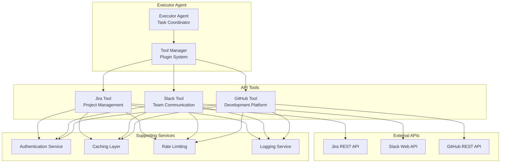
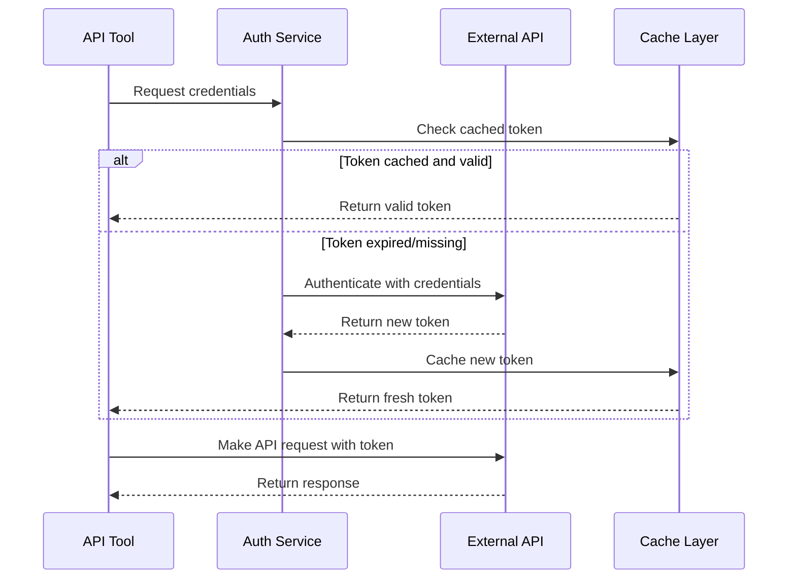

# API Integration Documentation

Comprehensive guide for integrating external APIs (Jira, Slack, GitHub) with the multi-agent system.

## 🌐 API Integration Architecture



## 🔐 Authentication & Authorization

### Authentication Flow


### Authentication Configuration
```go
type AuthConfig struct {
    Type           AuthType `json:"type"`
    ClientID       string   `json:"client_id"`
    ClientSecret   string   `json:"client_secret"`
    TokenURL       string   `json:"token_url"`
    Scope          []string `json:"scope"`
    TokenCacheTTL  time.Duration `json:"token_cache_ttl"`
    RefreshBuffer  time.Duration `json:"refresh_buffer"`
}

type AuthType string

const (
    AuthTypeOAuth2    AuthType = "oauth2"
    AuthTypeAPIKey    AuthType = "api_key"
    AuthTypeBasic     AuthType = "basic"
    AuthTypeBearer    AuthType = "bearer"
)
```

### Authentication Service Implementation
```go
type AuthService struct {
    configs map[string]*AuthConfig
    cache   TokenCache
    logger  *zap.Logger
}

func (a *AuthService) GetToken(ctx context.Context, service string) (string, error) {
    // Check cache first
    if token, ok := a.cache.Get(service); ok && a.isValid(token) {
        return token.Value, nil
    }

    // Refresh token
    config, exists := a.configs[service]
    if !exists {
        return "", fmt.Errorf("auth config not found for service: %s", service)
    }

    newToken, err := a.refreshToken(ctx, config)
    if err != nil {
        return "", fmt.Errorf("token refresh failed: %w", err)
    }

    a.cache.Set(service, newToken)
    return newToken.Value, nil
}
```

## 🔧 Jira API Integration

### Jira API Overview
- **Base URL**: `https://your-domain.atlassian.net/rest/api/3/`
- **Authentication**: OAuth 2.0 or Basic Auth
- **Rate Limit**: ~100 requests per minute
- **Key Endpoints**: Issues, Projects, Users, Sprints

### Configuration
```yaml
jira:
  base_url: "https://your-domain.atlassian.net"
  auth:
    type: "oauth2"
    client_id: "your-client-id"
    client_secret: "your-client-secret"
    token_url: "https://auth.atlassian.com/oauth/token"
    scope: ["read:jira-work", "read:jira-user"]
  rate_limit:
    requests_per_minute: 100
    burst_size: 20
  cache:
    ttl: "5m"
    max_size: 1000
```

### Implementation
```go
type JiraTool struct {
    client  *jira.Client
    config  *JiraConfig
    auth    *AuthService
    cache   *redis.Client
    limiter  *rate.Limiter
    logger  *zap.Logger
}

func (j *JiraTool) GetIssues(ctx context.Context, project string, jql string) ([]*jira.Issue, error) {
    // Check cache first
    cacheKey := fmt.Sprintf("jira:issues:%s:%s", project, jql)
    if cached, err := j.cache.Get(ctx, cacheKey).Bytes(); err == nil {
        var issues []*jira.Issue
        if json.Unmarshal(cached, &issues) == nil {
            return issues, nil
        }
    }

    // Apply rate limiting
    if !j.limiter.Allow() {
        return nil, fmt.Errorf("rate limit exceeded")
    }

    // Make API call
    issues, _, err := j.client.Issue.Search(ctx, jql, &jira.SearchOptions{
        MaxResults: 100,
    })
    if err != nil {
        return nil, fmt.Errorf("jira search failed: %w", err)
    }

    // Cache result
    if data, err := json.Marshal(issues); err == nil {
        j.cache.Set(ctx, cacheKey, data, 5*time.Minute)
    }

    return issues, nil
}

func (j *JiraTool) GetProject(ctx context.Context, key string) (*jira.Project, error) {
    project, _, err := j.client.Project.Get(ctx, key)
    if err != nil {
        return nil, fmt.Errorf("failed to get project: %w", err)
    }
    return project, nil
}

func (j *JiraTool) GetSprints(ctx context.Context, boardID int) ([]jira.Sprint, error) {
    sprints, _, err := j.client.Board.GetAllSprintsForBoard(ctx, boardID, &jira.GetAllSprintsOptions{
        State: "active,future",
    })
    if err != nil {
        return nil, fmt.Errorf("failed to get sprints: %w", err)
    }
    return sprints.Values, nil
}
```

### Data Models
```go
type JiraIssue struct {
    ID        string              `json:"id"`
    Key       string              `json:"key"`
    Fields    JiraIssueFields     `json:"fields"`
    Changelog *jira.Changelog     `json:"changelog,omitempty"`
}

type JiraIssueFields struct {
    Summary     string              `json:"summary"`
    Description string              `json:"description"`
    Status      *jira.Status        `json:"status"`
    Priority    *jira.Priority      `json:"priority"`
    Assignee    *jira.User          `json:"assignee"`
    Reporter    *jira.User          `json:"reporter"`
    Created     time.Time           `json:"created"`
    Updated     time.Time           `json:"updated"`
    Labels      []string            `json:"labels"`
    Components  []*jira.Component   `json:"components"`
}
```

## 💬 Slack API Integration

### Slack API Overview
- **Base URL**: `https://slack.com/api/`
- **Authentication**: OAuth 2.0 (Bearer Token)
- **Rate Limit**: Tier-based (varies by method)
- **Key Endpoints**: Channels, Messages, Users, Files

### Configuration
```yaml
slack:
  base_url: "https://slack.com/api"
  auth:
    type: "oauth2"
    client_id: "your-client-id"
    client_secret: "your-client-secret"
    token_url: "https://slack.com/api/oauth.v2.access"
    scope: ["channels:history", "users:read", "files:read"]
  rate_limit:
    tier: "tier3"  # ~50+ requests per minute
    retry_count: 3
  pagination:
    limit: 200
    max_pages: 10
```

### Implementation
```go
type SlackTool struct {
    client  *slack.Client
    config  *SlackConfig
    auth    *AuthService
    cache   *redis.Client
    limiter  *rate.Limiter
    logger  *zap.Logger
}

func (s *SlackTool) GetChannelMessages(ctx context.Context, channelID string, opts *GetMessagesOpts) ([]slack.Message, error) {
    // Apply rate limiting
    if !s.limiter.Allow() {
        return nil, fmt.Errorf("rate limit exceeded")
    }

    // Build parameters
    params := &slack.GetConversationHistoryParameters{
        ChannelID: channelID,
        Limit:     opts.Limit,
    }

    if opts.Oldest != "" {
        params.Oldest = opts.Oldest
    }
    if opts.Latest != "" {
        params.Latest = opts.Latest
    }

    // Get messages
    history, err := s.client.GetConversationHistoryContext(ctx, params)
    if err != nil {
        return nil, fmt.Errorf("failed to get conversation history: %w", err)
    }

    return history.Messages, nil
}

func (s *SlackTool) GetChannelInfo(ctx context.Context, channelID string) (*slack.Channel, error) {
    channel, err := s.client.GetConversationInfoContext(ctx, &slack.GetConversationInfoInput{
        ChannelID: channelID,
    })
    if err != nil {
        return nil, fmt.Errorf("failed to get channel info: %w", err)
    }
    return channel, nil
}

func (s *SlackTool) GetUsers(ctx context.Context) ([]slack.User, error) {
    // Check cache
    cacheKey := "slack:users"
    if cached, err := s.cache.Get(ctx, cacheKey).Bytes(); err == nil {
        var users []slack.User
        if json.Unmarshal(cached, &users) == nil {
            return users, nil
        }
    }

    // Get all users with pagination
    var users []slack.User
    cursor := ""

    for {
        pagination := slack.GetUsersPageLimit{
            Limit: 200,
        }
        if cursor != "" {
            pagination.Cursor = cursor
        }

        page, err := s.client.GetUsersContext(ctx, pagination)
        if err != nil {
            return nil, fmt.Errorf("failed to get users: %w", err)
        }

        users = append(users, page...)

        if page.ResponseMetaData.NextCursor == "" {
            break
        }
        cursor = page.ResponseMetaData.NextCursor
    }

    // Cache result
    if data, err := json.Marshal(users); err == nil {
        s.cache.Set(ctx, cacheKey, data, 1*time.Hour)
    }

    return users, nil
}
```

### Data Models
```go
type SlackMessage struct {
    ClientMsgID     string            `json:"client_msg_id"`
    Type            string            `json:"type"`
    Text            string            `json:"text"`
    User            string            `json:"user"`
    Ts              string            `json:"ts"`
    ThreadTs        string            `json:"thread_ts,omitempty"`
    Channel         string            `json:"channel"`
    Timestamp       time.Time         `json:"timestamp"`
    Reactions       []slack.Reaction  `json:"reactions,omitempty"`
    Files           []slack.File      `json:"files,omitempty"`
}

type GetMessagesOpts struct {
    Limit   int    `json:"limit"`
    Oldest  string `json:"oldest,omitempty"`
    Latest  string `json:"latest,omitempty"`
    Cursor  string `json:"cursor,omitempty"`
}
```

## 🐙 GitHub API Integration

### GitHub API Overview
- **Base URL**: `https://api.github.com/`
- **Authentication**: Personal Access Token or OAuth
- **Rate Limit**: 5,000 requests per hour (authenticated)
- **Key Endpoints**: Repositories, Issues, Pull Requests, Commits

### Configuration
```yaml
github:
  base_url: "https://api.github.com"
  auth:
    type: "bearer"
    token: "your-personal-access-token"
  rate_limit:
    requests_per_hour: 5000
    remaining_threshold: 100
  cache:
    ttl: "10m"
    max_size: 2000
```

### Implementation
```go
type GitHubTool struct {
    client  *github.Client
    config  *GitHubConfig
    auth    *AuthService
    cache   *redis.Client
    limiter  *rate.Limiter
    logger  *zap.Logger
}

func (g *GitHubTool) GetRepositoryIssues(ctx context.Context, owner, repo string, opts *github.IssueListByRepoOptions) ([]*github.Issue, error) {
    // Check rate limits
    limits, _, err := g.client.RateLimits(ctx)
    if err != nil {
        return nil, fmt.Errorf("failed to get rate limits: %w", err)
    }

    if limits.Core.Remaining < g.config.RateLimit.RemainingThreshold {
        return nil, fmt.Errorf("github rate limit threshold reached")
    }

    // Check cache
    cacheKey := fmt.Sprintf("github:issues:%s:%s", owner, repo)
    if cached, err := g.cache.Get(ctx, cacheKey).Bytes(); err == nil {
        var issues []*github.Issue
        if json.Unmarshal(cached, &issues) == nil {
            return issues, nil
        }
    }

    // Get issues
    issues, _, err := g.client.Issues.ListByRepo(ctx, owner, repo, opts)
    if err != nil {
        return nil, fmt.Errorf("failed to list repository issues: %w", err)
    }

    // Cache result
    if data, err := json.Marshal(issues); err == nil {
        g.cache.Set(ctx, cacheKey, data, 10*time.Minute)
    }

    return issues, nil
}

func (g *GitHubTool) GetRepository(ctx context.Context, owner, repo string) (*github.Repository, error) {
    repository, _, err := g.client.Repositories.Get(ctx, owner, repo)
    if err != nil {
        return nil, fmt.Errorf("failed to get repository: %w", err)
    }
    return repository, nil
}

func (g *GitHubTool) GetPullRequests(ctx context.Context, owner, repo string, opts *github.PullRequestListOptions) ([]*github.PullRequest, error) {
    prs, _, err := g.client.PullRequests.List(ctx, owner, repo, opts)
    if err != nil {
        return nil, fmt.Errorf("failed to list pull requests: %w", err)
    }
    return prs, nil
}

func (g *GitHubTool) GetCommits(ctx context.Context, owner, repo string, opts *github.CommitsListOptions) ([]*github.RepositoryCommit, error) {
    commits, _, err := g.client.Repositories.ListCommits(ctx, owner, repo, opts)
    if err != nil {
        return nil, fmt.Errorf("failed to list commits: %w", err)
    }
    return commits, nil
}
```

### Data Models
```go
type GitHubIssue struct {
    ID        *int64             `json:"id"`
    Number    int                `json:"number"`
    Title     string             `json:"title"`
    Body      string             `json:"body"`
    State     string             `json:"state"`
    User      *github.User       `json:"user"`
    Assignee  *github.User       `json:"assignee"`
    Labels    []github.Label     `json:"labels"`
    CreatedAt *time.Time         `json:"created_at"`
    UpdatedAt *time.Time         `json:"updated_at"`
    ClosedAt  *time.Time         `json:"closed_at"`
    URL       string             `json:"html_url"`
}

type GitHubRepository struct {
    ID          *int64        `json:"id"`
    Name        string        `json:"name"`
    FullName    string        `json:"full_name"`
    Description string        `json:"description"`
    Private     bool          `json:"private"`
    Owner       *github.User  `json:"owner"`
    Language    string        `json:"language"`
    ForksCount  int           `json:"forks_count"`
    StargazersCount int       `json:"stargazers_count"`
    CreatedAt   *time.Time    `json:"created_at"`
    UpdatedAt   *time.Time    `json:"updated_at"`
}
```

## 🚀 Tool System Architecture

### Tool Interface
```go
type Tool interface {
    // Tool identification
    Name() string
    Version() string
    Description() string

    // Tool execution
    Execute(ctx context.Context, params map[string]interface{}) (*ToolResult, error)
    Validate(params map[string]interface{}) error

    // Tool metadata
    GetSchema() *ToolSchema
    GetRateLimit() *RateLimitConfig
    GetCacheConfig() *CacheConfig
}

type ToolResult struct {
    Success   bool                   `json:"success"`
    Data      interface{}            `json:"data"`
    Metadata  map[string]string      `json:"metadata"`
    Error     string                 `json:"error,omitempty"`
    Timestamp time.Time              `json:"timestamp"`
}

type ToolSchema struct {
    Parameters map[string]*Parameter `json:"parameters"`
    Required   []string              `json:"required"`
    Returns    *Parameter            `json:"returns"`
}

type Parameter struct {
    Type        string      `json:"type"`
    Description string      `json:"description"`
    Required    bool        `json:"required"`
    Default     interface{} `json:"default,omitempty"`
    Enum        []string    `json:"enum,omitempty"`
}
```

### Tool Manager
```go
type ToolManager struct {
    tools  map[string]Tool
    auth   *AuthService
    cache  *redis.Client
    logger *zap.Logger
}

func (tm *ToolManager) RegisterTool(tool Tool) error {
    if _, exists := tm.tools[tool.Name()]; exists {
        return fmt.Errorf("tool %s already registered", tool.Name())
    }

    tm.tools[tool.Name()] = tool
    tm.logger.Info("Tool registered", zap.String("name", tool.Name()))
    return nil
}

func (tm *ToolManager) ExecuteTool(ctx context.Context, toolName string, params map[string]interface{}) (*ToolResult, error) {
    tool, exists := tm.tools[toolName]
    if !exists {
        return nil, fmt.Errorf("tool %s not found", toolName)
    }

    // Validate parameters
    if err := tool.Validate(params); err != nil {
        return nil, fmt.Errorf("parameter validation failed: %w", err)
    }

    // Execute tool
    result, err := tool.Execute(ctx, params)
    if err != nil {
        tm.logger.Error("Tool execution failed",
            zap.String("tool", toolName),
            zap.Error(err))
        return nil, err
    }

    return result, nil
}
```

## 🔄 Error Handling & Retry Logic

### Error Types
```go
type APIError struct {
    StatusCode int    `json:"status_code"`
    Message    string `json:"message"`
    Service    string `json:"service"`
    Retryable  bool   `json:"retryable"`
}

func (e *APIError) Error() string {
    return fmt.Sprintf("[%s] %d: %s", e.Service, e.StatusCode, e.Message)
}

type RateLimitError struct {
    APIError
    RetryAfter time.Duration `json:"retry_after"`
}

func NewRateLimitError(service string, retryAfter time.Duration) *RateLimitError {
    return &RateLimitError{
        APIError: APIError{
            StatusCode: 429,
            Message:    "Rate limit exceeded",
            Service:    service,
            Retryable:  true,
        },
        RetryAfter: retryAfter,
    }
}
```

### Retry Strategy
```go
type RetryConfig struct {
    MaxAttempts     int           `json:"max_attempts"`
    BaseDelay       time.Duration `json:"base_delay"`
    MaxDelay        time.Duration `json:"max_delay"`
    Multiplier      float64       `json:"multiplier"`
    Jitter          bool          `json:"jitter"`
    RetryableErrors []int         `json:"retryable_errors"`
}

func WithRetry(ctx context.Context, fn func() error, config *RetryConfig) error {
    var lastErr error

    for attempt := 0; attempt < config.MaxAttempts; attempt++ {
        err := fn()
        if err == nil {
            return nil
        }

        // Check if error is retryable
        var apiErr *APIError
        if errors.As(err, &apiErr) && !apiErr.Retryable {
            return err
        }

        lastErr = err

        // Calculate delay
        delay := config.BaseDelay * time.Duration(math.Pow(config.Multiplier, float64(attempt)))
        if delay > config.MaxDelay {
            delay = config.MaxDelay
        }

        // Add jitter
        if config.Jitter {
            delay = time.Duration(float64(delay) * (0.8 + 0.4*rand.Float64()))
        }

        select {
        case <-ctx.Done():
            return ctx.Err()
        case <-time.After(delay):
            continue
        }
    }

    return fmt.Errorf("max retry attempts reached: %w", lastErr)
}
```

## 📊 Monitoring & Metrics

### API Metrics
```go
type APIMetrics struct {
    RequestsTotal     int64         `json:"requests_total"`
    RequestsSuccess   int64         `json:"requests_success"`
    RequestsFailed    int64         `json:"requests_failed"`
    AverageLatency    time.Duration `json:"average_latency"`
    CacheHitRate      float64       `json:"cache_hit_rate"`
    RateLimitHits     int64         `json:"rate_limit_hits"`
    RetryAttempts     int64         `json:"retry_attempts"`
}

type MetricsCollector struct {
    metrics map[string]*APIMetrics
    mutex   sync.RWMutex
}

func (mc *MetricsCollector) RecordRequest(service string, success bool, latency time.Duration) {
    mc.mutex.Lock()
    defer mc.mutex.Unlock()

    if _, exists := mc.metrics[service]; !exists {
        mc.metrics[service] = &APIMetrics{}
    }

    metrics := mc.metrics[service]
    metrics.RequestsTotal++

    if success {
        metrics.RequestsSuccess++
    } else {
        metrics.RequestsFailed++
    }

    // Update average latency
    total := metrics.RequestsTotal
    metrics.AverageLatency = time.Duration(
        (int64(metrics.AverageLatency)*(total-1) + int64(latency)) / total,
    )
}
```

### Health Checks
```go
type HealthChecker struct {
    tools   map[string]Tool
    timeout time.Duration
}

func (hc *HealthChecker) CheckService(ctx context.Context, service string) error {
    tool, exists := hc.tools[service]
    if !exists {
        return fmt.Errorf("service %s not found", service)
    }

    healthCtx, cancel := context.WithTimeout(ctx, hc.timeout)
    defer cancel()

    // Perform a simple health check
    _, err := tool.Execute(healthCtx, map[string]interface{}{
        "action": "health_check",
    })

    return err
}

func (hc *HealthChecker) CheckAllServices(ctx context.Context) map[string]error {
    results := make(map[string]error)

    for service := range hc.tools {
        err := hc.CheckService(ctx, service)
        if err != nil {
            results[service] = err
        }
    }

    return results
}
```

## 🎯 Best Practices

### 1. Rate Limiting
- Always respect API rate limits
- Implement exponential backoff for retries
- Monitor remaining requests
- Cache responses to reduce API calls

### 2. Error Handling
- Categorize errors as retryable or non-retryable
- Implement circuit breakers for repeated failures
- Provide meaningful error messages
- Log errors with sufficient context

### 3. Data Security
- Never log sensitive credentials
- Use secure token storage
- Implement proper token refresh mechanisms
- Validate API responses

### 4. Performance
- Implement efficient caching strategies
- Use connection pooling for HTTP clients
- Batch API calls where possible
- Monitor and optimize response times

### 5. Monitoring
- Track API usage and success rates
- Monitor cache hit ratios
- Alert on rate limit thresholds
- Log performance metrics