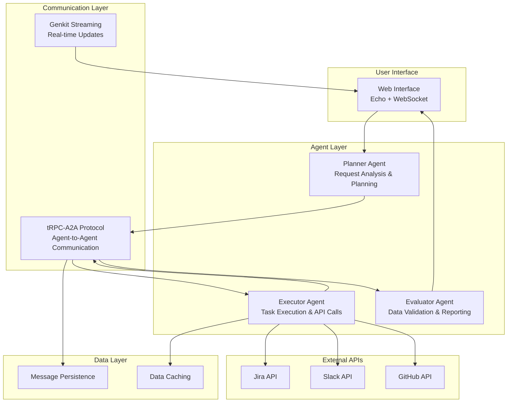
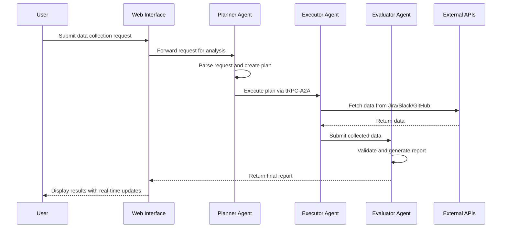
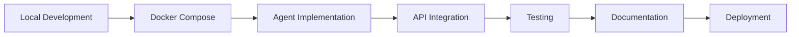

# Multi-Agent System Overview

A hierarchical multi-agent system built with Genkit Go for automated data collection and report generation from Jira, Slack, and GitHub.

## 🎯 Project Vision

Create a learning prototype that demonstrates:
- **Genkit streaming capabilities** for real-time communication
- **Tool usage patterns** for external API integration
- **tRPC-A2A protocol** for agent-to-agent communication
- **Hierarchical agent coordination** for complex workflows

## 🏗️ System Architecture



## 🔄 Workflow Process



## 🤖 Agent Hierarchy

### Planner Agent
- **Role**: Analyze user requests and create execution plans
- **Responsibilities**:
  - Parse natural language requests
  - Determine required data sources
  - Create task execution sequence
  - Coordinate with executor agent

### Executor Agent
- **Role**: Execute tasks and interact with external APIs
- **Responsibilities**:
  - Implement Jira, Slack, GitHub API clients
  - Handle authentication and rate limiting
  - Execute data collection tasks
  - Manage error handling and retries

### Evaluator Agent
- **Role**: Validate results and generate final reports
- **Responsibilities**:
  - Validate data completeness and quality
  - Generate structured reports
  - Apply data normalization
  - Ensure output consistency

## 🛠️ Technology Stack

### Core Technologies
- **Go**: Primary programming language
- **Genkit**: AI framework with streaming capabilities
- **Echo**: High-performance web framework
- **tRPC-A2A-Go**: Agent-to-agent communication protocol

### Communication & Real-time
- **Gorilla/WebSocket**: Real-time bidirectional communication
- **Genkit Streaming**: Real-time progress updates
- **Message Persistence**: SQLite/PostgreSQL for message storage

### External Integrations
- **Jira API**: Project management data
- **Slack API**: Team communication data
- **GitHub API**: Development workflow data

### Deployment
- **Docker**: Containerization
- **Docker Compose**: Local development environment
- **Go Modules**: Dependency management

## 📊 Key Features

### Real-time Communication
- WebSocket connections for live updates
- Genkit streaming for agent progress
- tRPC-A2A for structured agent communication

### External API Integration
- Configurable API clients
- Authentication management
- Rate limiting and error handling
- Data caching strategies

### Workflow Management
- Hierarchical task execution
- Message persistence for audit trails
- Error recovery mechanisms
- Progress tracking and reporting

### Web Interface
- Request submission forms
- Real-time progress visualization
- Report display and export
- Configuration management

## 🎯 Learning Objectives

### Genkit Integration
- Streaming capabilities implementation
- Tool system usage patterns
- AI model integration strategies
- Real-time communication patterns

### Multi-Agent Systems
- Hierarchical agent design
- Agent-to-agent communication protocols
- Task coordination and delegation
- Error handling and recovery

### External API Patterns
- RESTful API integration
- Authentication and authorization
- Rate limiting and throttling
- Data normalization and processing

### Web Development
- Real-time web applications
- WebSocket integration
- API design and implementation
- Containerized deployment

## 🚀 Getting Started

1. **Setup Development Environment**
   ```bash
   git clone <repository>
   cd multi-agent-system
   make setup
   ```

2. **Configure Environment**
   ```bash
   cp .env.example .env
   # Edit environment variables
   ```

3. **Run Development Server**
   ```bash
   make dev
   ```

4. **Access Web Interface**
   - Open `http://localhost:8080` in browser
   - Submit data collection requests
   - Monitor real-time progress

## 📝 Project Structure

```
multi-agent-system/
├── cmd/
│   └── server/
│       └── main.go
├── internal/
│   ├── agents/
│   │   ├── planner/
│   │   ├── executor/
│   │   └── evaluator/
│   ├── communication/
│   │   ├── trpc/
│   │   └── streaming/
│   ├── tools/
│   │   ├── jira/
│   │   ├── slack/
│   │   └── github/
│   └── web/
│       ├── handlers/
│       └── static/
├── pkg/
│   ├── models/
│   ├── storage/
│   └── config/
├── docs/
├── configs/
├── docker/
└── Makefile
```

## 🔄 Development Workflow



## 📈 Success Metrics

### Technical Metrics
- Agent response time < 2 seconds
- API integration success rate > 95%
- WebSocket connection stability
- Memory usage optimization

### Learning Metrics
- Genkit streaming capability demonstration
- tRPC-A2A protocol implementation
- Multi-agent coordination patterns
- External API integration patterns

### User Experience Metrics
- Real-time update responsiveness
- Report generation accuracy
- Error handling clarity
- Interface usability